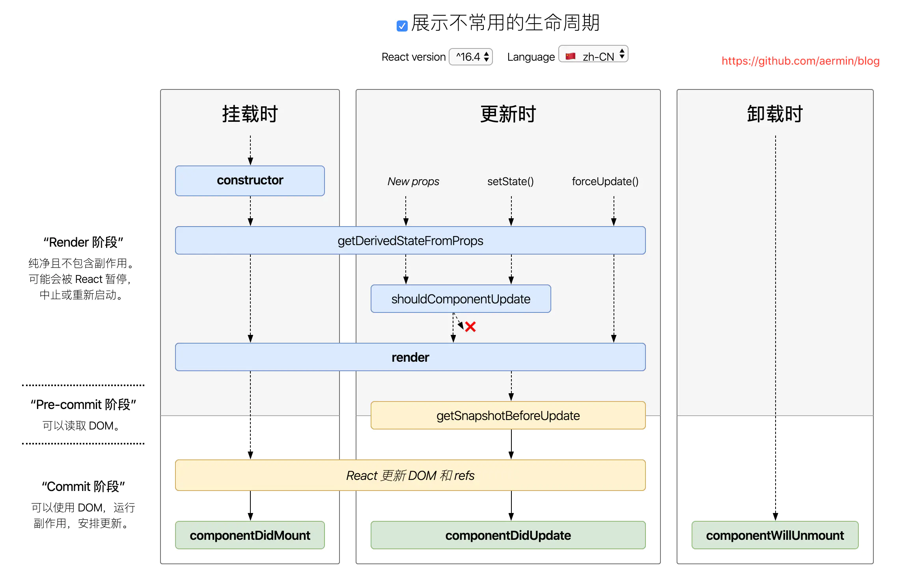

## 生命周期(老版)


```javascript
import React, { Component } from 'react';

class LifeCycle extends Component {
  /**组件的静态属性 */
  static defaultProps = { name: '计数器' };
  constructor(props) {
    /** setup props and state */
    super(props);
    this.state = { number: 0 };
    console.log('setup');
  }
  componentWillMount() {
    console.log('2 组件将要挂载');
  }
  componentDidMount() {
    console.log('4.组件挂载完成');
  }
  shouldComponentUpdate() {
    console.log('5. 询问组件是否要更新');
    return true;
  }
  componentWillUpdate() {
    console.log('6 组件将要更新');
  }
  componentDidUpdate() {
    console.log('7 组件已经更新完毕');
  }
  add = () => {
    this.setState({
      number: this.state.number + 1,
    });
  };
  render() {
    console.log('parent render');
    return (
      <div>
        <p>{this.state.name}</p>
        <button onClick={this.add}>+</button>
        <Sub />
      </div>
    );
  }
}

export default LifeCycle;

class Sub extends Component {
  constructor(props) {
    super(props);
    this.state = { age: 10 };
  }
  componentWillReceiveProps() {
    console.log('componentWillReceiveProps');
  }
  render() {
    console.log('children render');
    return (
      <div>
        <p>age:{this.state.age}</p>
        <button
          onClick={() => {
            this.setState({ age: this.state.age + 1 });
          }}
        ></button>
      </div>
    );
  }
}

```


## 生命周期新版




### getDerivedStateFromProps

```javascript
import React, { Component } from 'react';
class Counter extends Component {
  constructor(props) {
    super(props);
    this.state = { number: 0 };
  }
  add = () => {
    this.setState({
      number: this.state.number + 1,
    });
  };
  render() {
    return (
      <div>
        <p>{this.state.number}</p>
        <button onClick={this.add}>+</button>
        <SubCounter number={this.state.number} />
      </div>
    );
  }
}

class SubCounter extends Component {
  constructor(props) {
    super(props);
    this.state = { number: 0 };
  }
  /** 将State和Props传来的值全部整合到state上 */
  static getDerivedStateFromProps(nextProps, prevState) {
    if (nextProps.number % 2 === 0) {
      return { number: nextProps.number * 2 };
    } else {
      return { number: nextProps.number * 3 };
    }
  }
  render() {
    return <div>{this.state.number}</div>;
  }
}

export default Counter;

```


## getSnapshotBeforeUpdate

```javascript
import React, { Component } from 'react';
class getSnapshotBeforeUpdateComponent extends Component {
  constructor(props) {
    super(props);
    this.wrapper = React.createRef();
    this.state = { message: ['5', '4', '3', '2', '1'] };
  }

  componentDidMount() {
    setInterval(() => {
      this.setState({
        message: [this.state.message.length, ...this.state.message],
      });
    }, 1000);
  }

  getSnapshotBeforeUpdate() {
    return this.wrapper.current.scrollHeight;
  }
  componentDidUpdate(prevProps, prevState, scrollHeight) {
    let Dom = this.wrapper.current;
    Dom.scrollTop = Dom.scrollTop + (Dom.scrollHeight - scrollHeight);
  }
  render() {
    let style = {
      height: '100p',
      width: '200px',
      border: '1px solid red',
      overflow: 'auto',
    };
    return (
      <div style={style} ref={this.wrapper}>
        <ul>
          {this.state.message.map((item, index) => {
            return <li key={index}>{item}</li>;
          })}
        </ul>
      </div>
    );
  }
}

export default getSnapshotBeforeUpdateComponent;

```


## context(上下文)

### 旧版

```javascript
import React, { Component } from 'react';
import propTypes from 'prop-types';
class Page extends Component {
  static childContextTypes = {
    color: propTypes.string,
    setColor: propTypes.func,
  };
  getChildContext() {
    return { color: 'gray', setColor: this.setColor };
  }

  setColor = (color) => {
    this.setColor({ color });
  };
  constructor() {
    super();
    this.state = { color: 'gray' };
  }
  render() {
    return (
      <>
        <Header>
          <Title></Title>
        </Header>
        <Main>
          <Content></Content>
        </Main>
      </>
    );
  }
}

class Header extends Component {
  render() {
    return (
      <div>
        Header
        <Title></Title>
      </div>
    );
  }
}

class Title extends Component {
  /** 子集关系 */
  static contextTypes = {
    color: propTypes.string,
    setColor: propTypes.func,
  };
  /**
   * this.context.color
   * this.context.setColor
   */

  render() {
    return <div>Title</div>;
  }
}

class Main extends Component {
  render() {
    return (
      <div>
        Main
        <Content></Content>
      </div>
    );
  }
}

class Content extends Component {
  render() {
    return <div>Content</div>;
  }
}

export default Page;

```


### 新版

```javascript
// import { func } from 'prop-types';
import React, { Component } from 'react';
// import propTypes from 'prop-types';
const ThemeContext = React.createContext();
/**
 * ThemeContext = {Provider Consumer}
 *
 */

/**-------- createContext -----------------------------------*/

function createContext() {
  class Provider extends Component {
    static value;
    constructor(props) {
      super(props);
      Provider.value = props.value;
    }
    render() {
      return this.props.children;
    }
  }

  class Consumer extends Component {
    render() {
      return this.props.children(Provider.value);
    }
  }

  return { Provider, Consumer };
}

/**----------------------------------------------------------- */

class Page extends Component {
  constructor() {
    super();
    this.state = { color: 'gray' };
  }
  setColor(color) {
    this.setState({ color });
  }
  render() {
    let ctx = { color: 'gray', setColor: this.setColor };
    return (
      <ThemeContext.Provider value={ctx}>
        <Header>
          <Title></Title>
        </Header>
        <Main>
          <Content></Content>
        </Main>
      </ThemeContext.Provider>
    );
  }
}

class Header extends Component {
  /**----------------------------------------------- */
  static contextType = ThemeContext;
  /**----------------------------------------------- */

  /**
   * this.context 拿到了所有的值
   */
  render() {
    return (
      <div>
        Header
        <Title></Title>
      </div>
    );
  }
}

function Title(props) {
  return <div>title</div>;
}

class Main extends Component {
  render() {
    return (
      <div>
        Main
        <Content></Content>
      </div>
    );
  }
}

class Content extends Component {
  render() {
    return <div>Content</div>;
  }
}

export default Page;

```

### pureComponent
```javascript
import React, {PureComponent} from 'react'


class Title extends PureComponent {
	render(){
		return <div>{this.props.title}</div>
	}
}

class Counter extends PureComponent {
	render(){
		return (<div>{this.props.number}</div>);
	}
}


export default class App extends PureComponent {
	constructor(props){
		super(props);
		this.props = props;
		this.state = { title:'计数器', number: 0 }
		this.inputRef = React.createRef();
	}
	add = () =>{
		this.setState({
			number: this.state.number + parseInt(this.inputRef.current.value)
		})
	}
	render(){
		return (
			<div>
				<Title title={this.state.title}/>
				<Counter number={this.state.number}/>
				<input ref={inputRef}/>
				<button onClick={this.add}>+</button>
			</div>
		)
	}
}
```


```javascript
import React, { Component } from 'react';

export default class PureComponent extends Component {
  isPureComponent = true;
  shouldComponentUpdate(nextProps, nextState) {
    return (
      !shallowEqual(this.props, nextProps) ||
      !shallowEqual(this.state, nextState)
    );
  }
  render() {
    return <div>1</div>;
  }
}

function shallowEqual(obj1, obj2) {
  if (obj1 === obj2) return true;
  if (
    typeof obj1 !== 'object' ||
    obj1 === null ||
    typeof obj2 !== 'object' ||
    obj2 === null
  ) {
    return false;
  }

  let keys1 = Object.keys(obj1);
  let keys2 = Object.keys(obj2);
  if (keys1.length !== keys2.length) return false;

  for (let key of keys1) {
    if (!obj2.hasOwnProperty(key)) {
      if (obj1[key] !== obj2[key]) {
        if (typeof obj1[key] === 'object' && typeof obj2[key] === 'object') {
          return shallowEqual(obj1[key], obj2[key]);
        }
      } else {
        return false;
      }
    }
  }
  return true;
}

```

## memo

```react
import React, { PureComponent } from 'react';

function memo(FunComponent) {
  return class Proxy extends PureComponent {
    render() {
      return FunComponent(this.props)
    }
  };
}
export default memo;

```


## 高阶组件

```react
/**
 * 高阶函数 传入一个函数 返回一个新的函数
 * 高阶组件 传入一个组件 返回一个新的组件
 */

import React from 'react';
export default function withLogger(Comp) {
  return class extends React.Component {
    componentWillMount() {
      this.start = Date.now();
    }
    componentDidMount() {
      console.log(Date.now() - this.start + 'ms');
    }

    render() {
      return <Comp {...this.props} />;
    }
  };
}

```


## render props

```react
<MouseTracker>
	{
        (props)=><Pirture {...props}/>
    }
</MouseTracker>


import React, { Component } from 'react';
class MouseTracker extends Component {
  constructor(props) {
    super(props);
    this.state = { x: 0, y: 0 };
  }
  handleMouseMove = (event) => {
    this.setState({
      x: event.clientX,
      y: event.clientY,
    });
  };
  render() {
    return (
      <div onMouseOver={this.handleMouseMove}>
            /* 执行子组件 函数组件*/
        {this.props.children({ x: this.state.x, y: this.state.y })}
      </div>
    );
  }
}

export default MouseTracker;

```


## Frament

```javascript
  <React.Fragment>
```


## protal

```javascript
import React, { Component } from 'react';
import ReactDOM from 'react-dom';
class Modal extends Component {
  constructor(props) {
    super(props);
    this.modal = document.getElementById('modal-root');
  }
  render() {
    return ReactDOM.createPortal(this.props.children, this.modal);
  }
}

class Page extends Component {
  constructor(prop) {
    super(prop);
    this.state = { show: false };
  }
  toggleModal = () => {
    this.setState({
      show: !this.state.show,
    });
  };
  render() {
    return (
      <div>
        <button onClick={this.toggleModal}>关闭/显示</button>
        {this.state.show && (
          <Modal>
            <div id='modal' className='modal'>
              <div id='content' className='content'>
                Modal
              </div>
            </div>
          </Modal>
        )}
      </div>
    );
  }
}

export default Page;

```


## 错误边界

```javascript
import React, { Component } from 'react';
class ErrorBoundary extends Component {
  constructor(props) {
    super(props);
    this.state = { hasErrors: false };
  }
   /* 捕获异常 检查错误*/
  componentDidCatch(err, info) {
    if (err) {
      this.setState({
        hasErrors: true,
      });
    }
  }
  render() {
    if (this.state.hasErrors) {
      return <div> error</div>;
    } else {
      return this.props.children;
    }
  }
}

class Clock extends Component {
  render() {
    return <div>{Date.now()}</div>;
  }
}

class page extends Component {
  render() {
    return (
      <ErrorBoundary>
        <Clock />
      </ErrorBoundary>
    );
  }
}

export default page;

```

