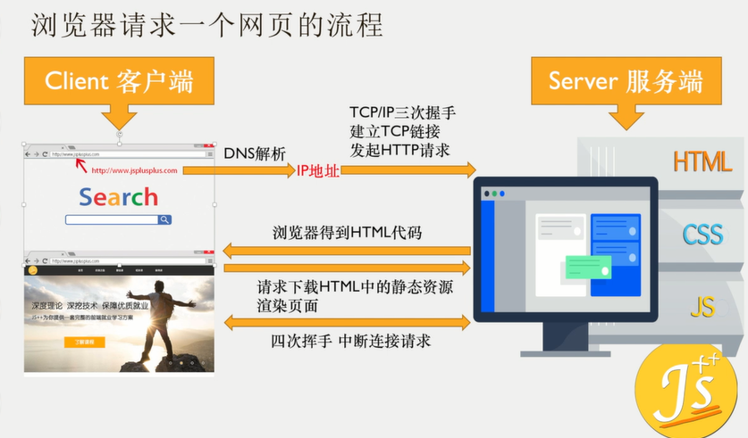

## client && server




## URI

+ URI Uniform Resource Identifier

  统一资源标志符 用来唯一的标识一个资源

+ URL Uniform Resource Locator

  统一资源定位符 URL 可以用来表示一个资源 而且还指明了如何定位一个资源 用地址定位一个资源

+ URN Uniform Resource Name

  统一资源命名 通过名字来表示资源 用名称定位一个资源


## 端口号

```text
http 80
https 443
MySql 3306
协议名 + 主机名 + 端口号 + 路径 + 文件 + 处理所需的字符串
```


## 客户端和服务端

+ C/S架构和B/S架构